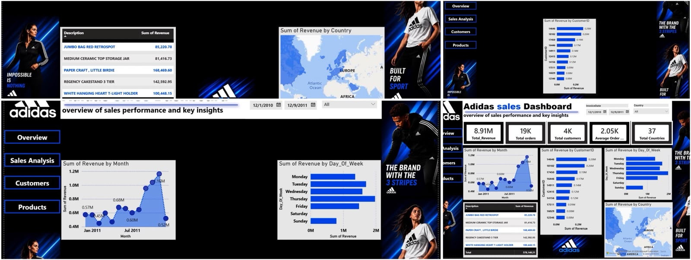

# Adidas E-commerce Sales Dashboard

## Project Overview
This Power BI dashboard analyzes e-commerce sales performance using the Online Retail dataset.

## Tools Used
- Power BI
- SQL
- Python (Pandas)
- GitHub

## Dashboard Features
- Total Revenue
- Total Orders
- Total Customers
- Average Order Value
- Monthly Revenue Trend
- Top Customers
- Revenue by Day of Week
- Revenue by Country
- Top Products

## Files
- Adidas_Ecommerce_Dashboard.pbix
- revenue_by_month.csv
- revenue_by_country.csv
- revenue_by_day.csv
- top_customers.csv
- top_products_qty.csv
- top_products_revenue.csv

## Dashboard Preview

